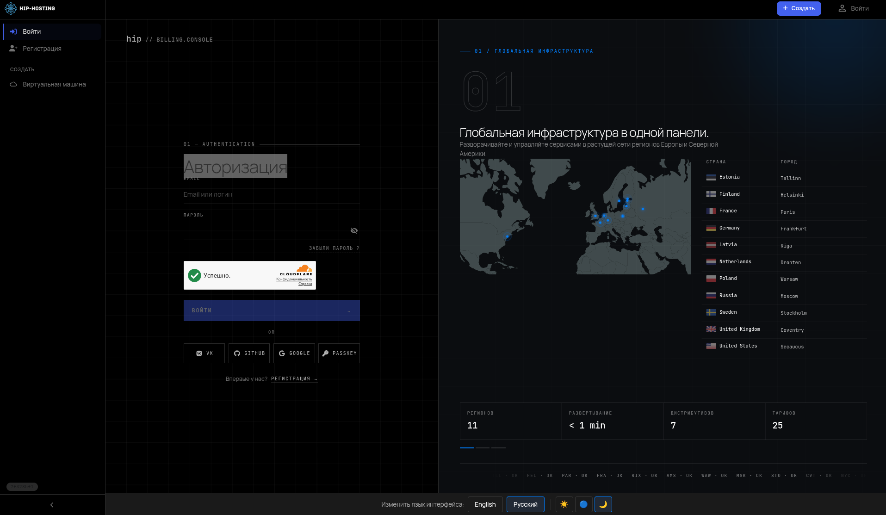
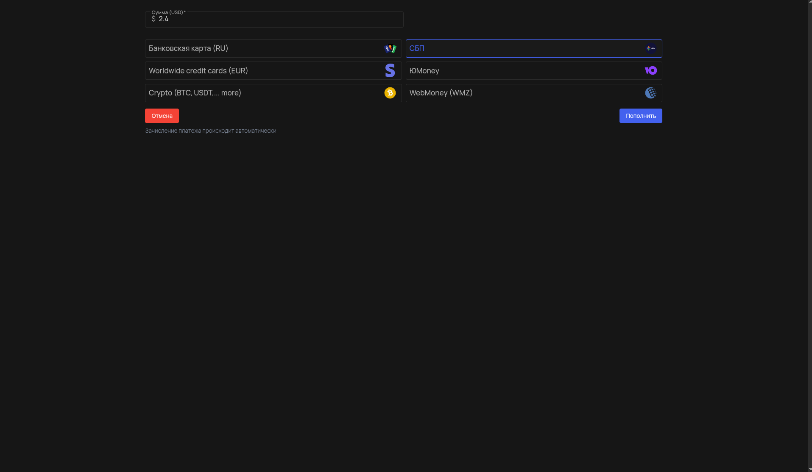
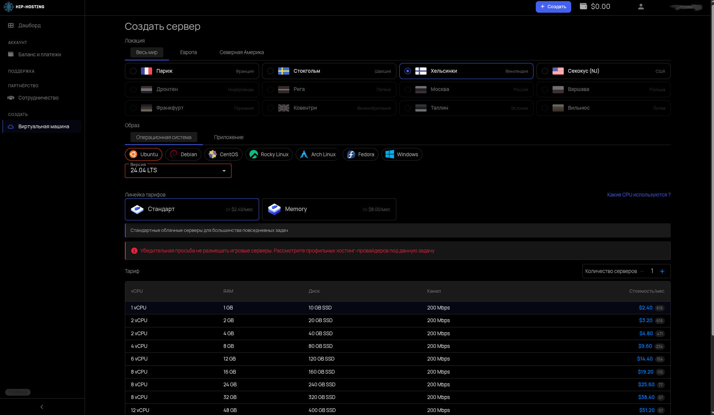
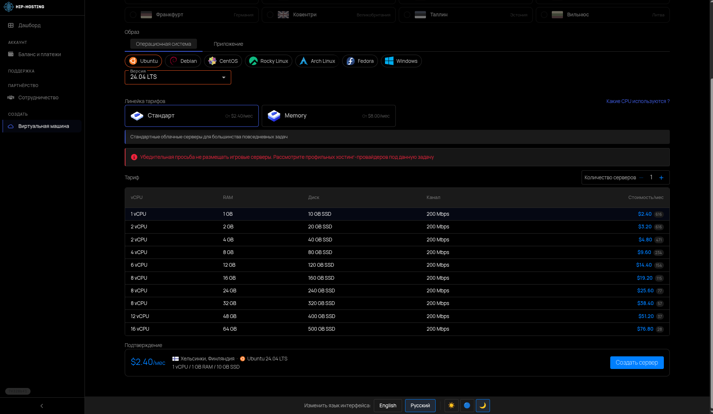
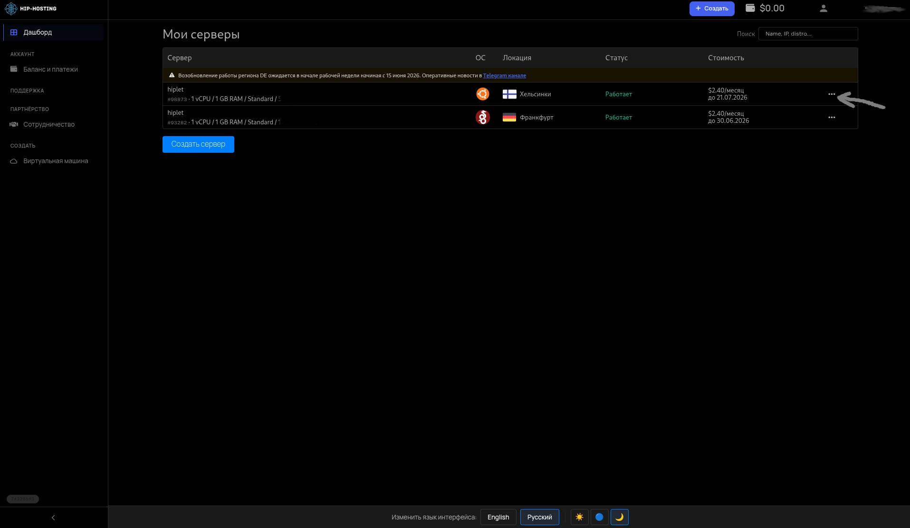
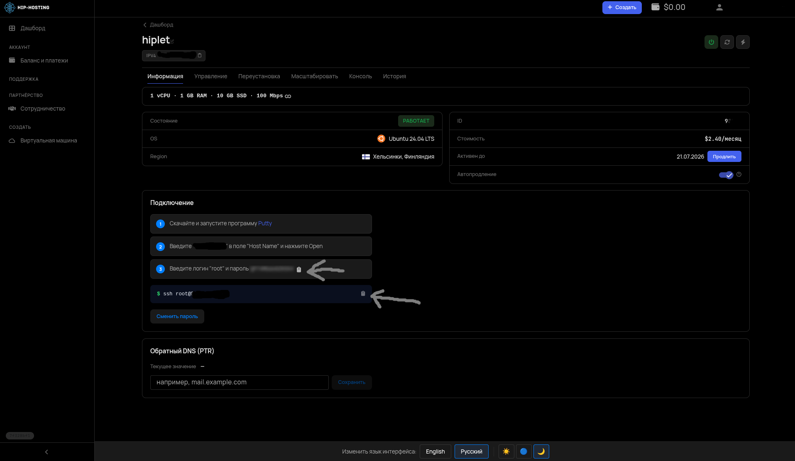

# 🗄️ ГАЙД ПО ПОКУПКЕ СЕРВЕРА
---
## Шаг 1: <a href="https://my.hip.hosting/login" target="_blank"> Пройдите авторизацию на сайте</a>



---
## Шаг 2: Пополните кошелек Hip-Hosting на 2.4$ (~180р)



---
## Шаг 3: Выберите сервер Хельсинки (самый стабильный сервер на данный момент)



---
## Шаг 4: Нажмите "Создать сервер"



> После создания сервера нужно подождать примено 15 минут!
---
## Шаг 5: На вкладке "Дашборд" нажмите на три точки --> управление



---
## Шаг 6: Скопируйте команду и вставьте ее в терминал



---
## Шаг 7: Скопируйте пароль и вставьте его в терминал
> Важное предупреждение! Пароль при вводе в терминал НЕ ВИДЕН!


---
---
# 🖥 ГАЙД ПО НАСТРОЙКЕ HYSTERIA2 НА СЕРВЕРЕ

## 🔹 Шаг 1: Обновление системы

```bash
apt update && apt upgrade -y
apt install -y curl wget nano openssl
```

---

## 🔹 Шаг 2: Установка Hysteria2

```bash
bash <(curl -fsSL https://get.hy2.sh/)
```

Проверка:
```bash
hysteria version
```

---

## 🔹 Шаг 3: Создание папки и сертификатов

```bash
mkdir -p /etc/hysteria

# Генерация самоподписного сертификата (на 10 лет)
openssl req -x509 -nodes -newkey ec:<(openssl ecparam -name prime256v1) \
  -keyout /etc/hysteria/key.pem \
  -out /etc/hysteria/cert.pem \
  -subj "/CN=bing.com" -days 36500
```

---

## 🔹 Шаг 4: Конфиг Hysteria2

> Тут нужно заменить "user1: "password1" user2: "password2"" на свое.

```bash
cat > /etc/hysteria/config.yaml << 'EOF'
listen: :443

tls:
  cert: /etc/hysteria/cert.pem
  key: /etc/hysteria/key.pem

auth:
  type: userpass
  userpass:
    user1: "password1"
    user2: "password2"

bandwidth:
  up: 90 mbps
  down: 100 mbps

ignoreClientBandwidth: true
EOF
```

**Добавить пользователя:**
```bash
nano /etc/hysteria/config.yaml
# Добавь строку в блок userpass:
#    newuser: "newpassword"
```

---

## 🔹 Шаг 5: Оптимизация ядра (BBR)

```bash
cat > /etc/sysctl.d/99-hysteria.conf << 'EOF'
net.core.default_qdisc = fq
net.ipv4.tcp_congestion_control = bbr
net.ipv4.tcp_fastopen = 3
net.ipv4.tcp_slow_start_after_idle = 0
net.ipv4.tcp_mtu_probing = 1
net.core.rmem_max = 16777216
net.core.wmem_max = 16777216
net.ipv4.tcp_rmem = 4096 87380 16777216
net.ipv4.tcp_wmem = 4096 65536 16777216
EOF

sysctl --system
```

Проверка BBR:
```bash
sysctl net.ipv4.tcp_congestion_control
# Должно вывести: net.ipv4.tcp_congestion_control = bbr
```

---

## 🔹 Шаг 6: Systemd-сервис

Hysteria2 создаёт сервис автоматически. Проверь:

```bash
systemctl status hysteria-server
```

Если не создан:
```bash
cat > /etc/systemd/system/hysteria-server.service << 'EOF'
[Unit]
Description=Hysteria2 Server
After=network.target

[Service]
Type=simple
ExecStart=/usr/local/bin/hysteria server -c /etc/hysteria/config.yaml
Restart=on-failure
RestartSec=5
LimitNOFILE=1048576

[Install]
WantedBy=multi-user.target
EOF

systemctl daemon-reload
systemctl enable --now hysteria-server
```

---

## 🔹 Шаг 7: Фаервол

```bash
# UFW
ufw allow 443/udp
ufw allow 443/tcp
ufw reload

# Или iptables
iptables -A INPUT -p udp --dport 443 -j ACCEPT
iptables -A INPUT -p tcp --dport 443 -j ACCEPT
```

---

## 🔹 Шаг 8: Запуск и проверка

```bash
# Запустить
systemctl start hysteria-server

# Включить автозапуск
systemctl enable hysteria-server

# Статус
systemctl status hysteria-server --no-pager

# Проверить порт
ss -ulnp | grep 443

# Логи
journalctl -u hysteria-server -f
```

---

## 🔹 Шаг 9: Генерация ссылок для клиентов

```bash
# Узнать IP
IP=$(curl -s ifconfig.me)

# Сгенерировать все ссылки
grep -E "^    [a-zA-Z0-9]+:" /etc/hysteria/config.yaml | sed 's/"//g' | awk -v ip="$IP" -F': ' '{gsub(^ +/,"",$1); print "hysteria2://"$1"%3A"$2"@"ip":443/?insecure=1#"$1}'
```

---

## 🔹 Шаг 10: Управление пользователями

**Добавить:**
```bash
nano /etc/hysteria/config.yaml
# Добавь в userpass:
#    newuser: "newpass"
systemctl restart hysteria-server # Обязательно для перезагрузки сервера и ввода новых данных
```

**Удалить:**
```bash
nano /etc/hysteria/config.yaml
# Удали строку пользователя
systemctl restart hysteria-server # Обязательно для перезагрузки сервера и ввода новых данных
```

---

## 📁 Структура файлов

```
/etc/hysteria/
├── config.yaml      # Конфиг с пользователями
├── cert.pem         # Сертификат
└── key.pem          # Приватный ключ
```
---
# Важное примечание: 
> После вставки ссылки в приложение-клиент нужно поставить: Insecure - true

---

# Готово — сервер VPN работает. 🔧
